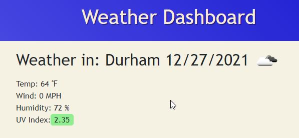

# Weather-Dashboard

## Overview: 

I built a A weather dashboard that runs in the browser and features a dynamically updated HTML using JavaScript.

## Technologies used: 
  * HTML
  * CSS
  * JavaScript
  * Moment.js

View live site at: https://reinholz36.github.io/Weather-Dashboard//

